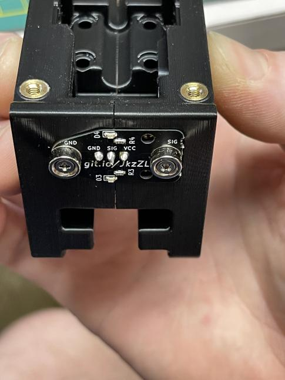
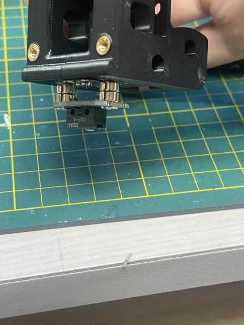
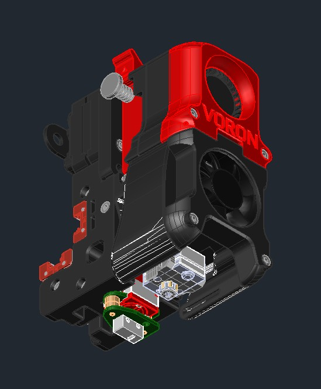
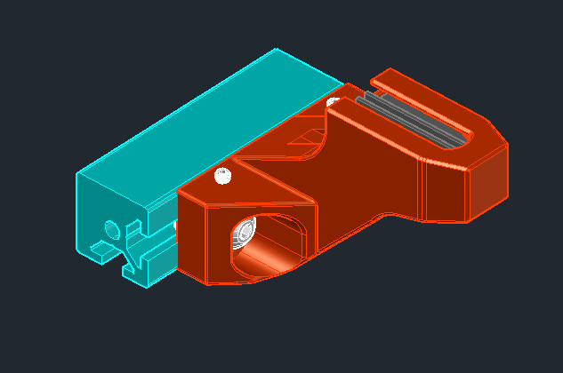

# Repository of stl's for Voron printers

## Clockwork1 - 2xMGN9 Rail - Afterburner Native Mounts
The left and right halves of the Afterburner carriage are modified to accept the probe with M3 screws and heatserts from underneath. Fine tuning and tweaking credited to garbqgebag.  
  
  

## Clockwork1 - MGN12 Rail - Trident Native Mounts
The left and right halves of the Afterburner carriage are modified to accept the probe with M3 screws and heatserts from underneath. Fine tuning and tweaking credited to garbqgebag.  
  
  

## Omron Mounts
The standard Omron mount is 0 degree relative rotation to the mounting face of the Omron device. Adjustment slots are similar to the original device.  Designed to be printed upside-down without supports.  

  

The Omron mount also exists in 90 degree version with the probe pointing backwards instead of sideways.

## Voron Trident Dock Mount  
The mount attaches with longer screws in the native holes of the left side motor bracket and clears the radius of the cable chain. 3-M5x20 screws required.     
The dock attaches to the mount with an M5 nut dropped in the keyholed channel and thru-bolts with an M5x20 screw. Adjust the elevation as required to allow for a clean exit of the probe PCB. Fine tuning and tweaking credited to Dattas.

## Gantry Dock & Mount
This dock is orientated in the X direction and attaches to the rear extrusion of the gantry, in the native holes of the left side motor bracket. Requires the use of the Omron mount or Native Afterburner Carriage. Attaches with longer screws, M5x16. Lateral Y adjustment via the thru-bolt on the bottom, M5x16. Fine vertical adjustment via the slotted holes in the Omron mount or with shims between the Y adjuster. Currently untested and unproven to our knowledge- please contact us if difficulties are encountered. This configuration should be compatible with the other detachable probe macros for Voron.  

## 90 Degree  Gantry Dock & Mount
This mount attaches to the rear extrusion of the gantry, attaches with longer screws, M5x16, in the native holes of the left side motor bracket. Requires the use of the Omron90 mount. Lateral adjustment buy the thru-bolt on the bottom, M5x16. Fine vertical adjustment via the slotted holes in the Omron mount.  This configuration should be compatible with the other detachable probe macros for Voron orientated in the Y direction. 

## Voron 2.4 Bed Rail Mounted Dock  
The bed mounts are provided in 2 heights to suit the overall stack height of the bed plate and printing surfaces. This dock has been tested by multiple users. Fine tuning and tweaking credited to kageurufu.

The stls are provided to print 'nose' down and have minimal print in place supports to ensure that the back shoulder is printed and aligned. 

The bed rail mount uses 2-M5x16 screws and extrusion nuts to attach to either side of the extrusions that support the bed. 

There are 2 hex-shaped cross holes to the main mounting screws- these are provided to insert M3 screws to use as fine adjusters without tapping. They can be M3 setscrews and left in place or any M3 screw used temporarily.  
  
  
  
